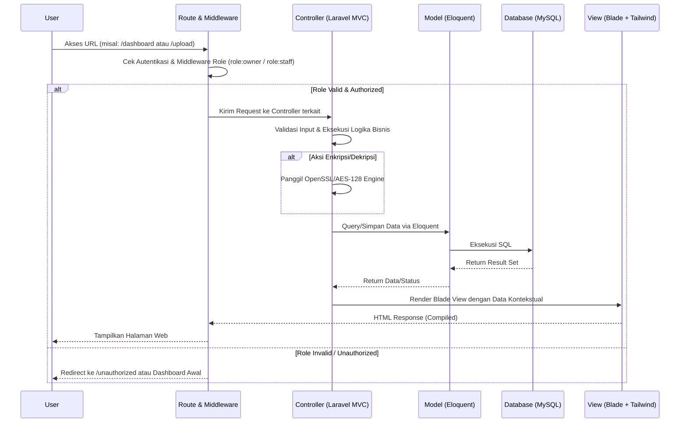
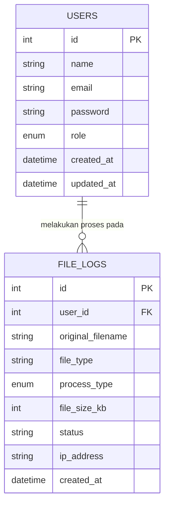

# PRD — Project Requirements Document

## 1. Overview
Aplikasi ini adalah platform keamanan file berbasis web yang dirancang khusus untuk penelitian tugas akhir (skripsi). Fokus utamanya adalah mencegah kebocoran atau pencurian dokumen penting klien (file desain JPG/PNG dan invoice PDF) melalui fitur enkripsi dan dekripsi menggunakan algoritma AES-128. Aplikasi ini dibangun menggunakan arsitektur monolitik *fullstack Laravel*, yang mengintegrasikan tampilan antarmuka (Laravel Blade + Tailwind CSS) dan logika bisnis dalam satu basis kode. Tujuannya adalah memastikan kerahasiaan file hanya dapat diakses oleh pihak yang memiliki kunci rahasia, dengan ditambahkan sistem manajemen peran (RBAC) yang memisahkan hak akses secara ketat antara pemilik sistem dan karyawan operasional.

## 2. Requirements
*   **Persyaratan Fungsional:**
    *   Sistem hanya menerima format file spesifik: `.jpg`, `.png`, dan `.pdf`.
    *   Sistem mampu melakukan enkripsi file menjadi format aman (`.enc`) dan dekripsi kembali ke format asli.
    *   Sistem mengharuskan pengguna memasukkan "Kunci Rahasia" (Secret Key) secara manual setiap kali proses enkripsi/dekripsi dilakukan.
    *   Sistem menerapkan Role-Based Access Control (RBAC) dengan dua level akses: **Owner** dan **Staff**.
    *   **Owner:** Akses penuh ke sistem, dapat melihat seluruh database file/riwayat, menghapus file/log global, dan melakukan manajemen user (CRUD akun Staff).
    *   **Staff:** Akses terbatas hanya untuk upload file, melakukan enkripsi/dekripsi, dan melihat riwayat/file yang dibuat oleh akun itu sendiri. Staff tidak dapat menghapus user, memanipulasi data global, atau mengakses dashboard Owner.
    *   Sistem menyediakan dua dashboard yang terpisah secara konten dan fitur berdasarkan role pengguna.
    *   Semua rute yang memerlukan autentikasi akan diproteksi menggunakan middleware Laravel (`auth`, `role:owner`, `role:staff`).
*   **Persyaratan Non-Fungsional:**
    *   Antarmuka pengguna (UI) harus sederhana, responsif, dan intuitif, di-render menggunakan Laravel Blade dengan styling Tailwind CSS.
    *   Sistem berjalan cukup cepat untuk memproses file desain berukuran sedang hingga besar tanpa membebani client.
    *   Keamanan data terjamin berdasarkan prinsip MVC larut: Controller menangani otorisasi dan alur, Model menangani query, View hanya bertugas menampilkan data. Kunci rahasia tidak pernah disimpan di database.
    *   arsitektur monolitik memastikan konsistensi session, keamanan CSRF bawaan, dan kemudahan deployment untuk keperluan penelitian.
*   **Persyaratan Akademis (Skripsi):** Dapat mendemonstrasikan proses kerja algoritma AES-128, penerapan middleware authorization, dan manajemen akses RBAC dalam konteks keamanan aplikasi web secara logis dan terdokumentasi.

## 3. Core Features
*   **Ruang Gembok (Enkripsi File):** Fitur utama untuk mengunggah file JPG, PNG, atau PDF, lalu menguncinya dengan password/kunci rahasia menggunakan AES-128 di sisi backend.
*   **Ruang Buka (Dekripsi File):** Fitur untuk mengunggah file yang sudah terkunci (`.enc`), memasukkan kunci rahasia yang valid, dan mengembalikannya menjadi file asli yang bisa dibuka.
*   **Manajemen Kunci Rahasia:** Input kunci dibuat per-sesi proses. Sistem tidak menyimpan kunci di database untuk mencegah kebocoran data kriptografi.
*   **Dashboard Owner:** Tampilan ringkasan sistem global (total file diproses, total staff aktif, grafik aktivitas harian/mingguan), akses ke menu Manajemen User, dan akses ke seluruh riwayat audit log.
*   **Dashboard Staff:** Tampilan ringkasan personal (status file terakhir diupload, riwayat enkripsi/dekripsi milik sendiri saja). Tidak ada akses ke menu manajemen sistem.
*   **User Management (Khusus Owner):** Fitur CRUD (Create, Read, Update, Delete) untuk mengelola akun Staff. Owner dapat membuat akun baru, mengedit profil/status staff, atau menghapus akun staff. Registrasi publik dinonaktifkan; hanya Owner yang bisa membuat user.
*   **Riwayat File & Audit Log:** Sistem mencatat log setiap aktivitas pemrosesan file. Owner melihat seluruh log sistem, Staff hanya melihat log yang memiliki `user_id` sesuai akun mereka. Data difokuskan untuk bahan analisis performa dan keamanan skripsi.

## 4. User Flow
**Skenario Registrasi & Login (Umum):**
1. Owner membuat akun Staff melalui panel "Manajemen User" di dashboard Owner.
2. Pengguna (Owner/Staff) masuk ke halaman login.
3. Sistem memverifikasi kredensial, membaca kolom `role` dari tabel `users`, dan mengarahkan ke rute dashboard yang sesuai via middleware `role:owner` atau `role:staff`.

**Skenario Mengamankan File (Enkripsi) - Staff/Owner:**
1. Pengguna login sesuai role dan masuk ke menu "Enkripsi File".
2. Mengunggah file desain/invoice (JPG/PNG/PDF) & memasukkan Kunci Rahasia.
3. Klik tombol "Amankan File".
4. Sistem memproses AES-128 di backend, menyimpan log ke `file_logs` dengan `user_id` terkait.
5. Pengguna mengunduh file `.enc` yang telah dienkripsi.

**Skenario Membuka File (Dekripsi) - Staff/Owner:**
1. Pengguna login dan masuk ke menu "Dekripsi File".
2. Mengunggah file `.enc` & memasukkan Kunci Rahasia yang sama.
3. Klik tombol "Buka File".
4. Sistem mendekripsi, memvalidasi integrity, dan menyediakan file asli untuk diunduh.

**Skenario Manajemen User (Khusus Owner):**
1. Owner masuk ke menu "Manajemen User".
2. Melihat daftar seluruh staff. Mematuhi middleware `role:owner`.
3. Melakukan aksi `Create` (tambah staff dengan email/password/role), `Update` (ubah data/status), atau `Delete` (hapus staff).
4. Sistem memvalidasi middleware sebelum eksekusi aksi. Jika diakses oleh Staff, sistem mengembalikan status 403 Forbidden.

## 5. Architecture
Aplikasi ini menggunakan arsitektur *Monolithic Fullstack Laravel*. Frontend dan Backend berjalan dalam satu proyek terintegrasi. Controller menangani permintaan HTTP, validasi input, otorisasi via middleware, logika kriptografi AES-128, dan interaksi database. View menggunakan Laravel Blade yang di-render langsung ke sisi klien. Pendekatan ini memenuhi prinsip MVC secara ketat, mengurangi kompleksitas deployment, memastikan keamanan session bawaan Laravel, dan mempercepat siklus pengembangan untuk penelitian.

## 6. Database Schema
Database dirancang minimalis namun cukup untuk mendukung RBAC, audit trail, dan analisis skripsi tanpa redundansi yang berlebihan.

**Tabel `users`** (Menyimpan data pengguna & role sistem)
*   `id` (Primary Key, UUID/Int) - ID unik pengguna
*   `name` (String) - Nama pengguna
*   `email` (String, Unique) - Email untuk login
*   `password` (String) - Password aplikasi yang di-hash (bcrypt/argon2)
*   `role` (Enum: 'owner', 'staff') - Hak akses sistem. Default: 'staff'.
*   `created_at` & `updated_at` (Timestamp)

**Tabel `file_logs`** (Menyimpan riwayat proses untuk audit & skripsi)
*   `id` (Primary Key, UUID/Int) - ID unik riwayat
*   `user_id` (Foreign Key -> users.id) - Penanda pemilik proses (untuk filter data staff)
*   `original_filename` (String) - Nama file asli sebelum diproses
*   `file_type` (String) - Ekstensi file (jpg, png, pdf)
*   `process_type` (Enum) - Jenis pekerjaan ('encryption' atau 'decryption')
*   `file_size_kb` (Int) - Ukuran file saat pemrosesan (bahan analisis performa)
*   `status` (String) - Status keberhasilan ('success' atau 'failed')
*   `ip_address` (String, Nullable) - Alamat IP pengakses (untuk audit keamanan)
*   `created_at` (Timestamp) - Waktu proses dilakukan

## 7. Tech Stack
Tumpukan teknologi disederhanakan menjadi monolitik fullstack untuk efisiensi pengembangan, keamanan, dan kemudahan deployment skripsi:

*   **Framework Utama:** **Laravel 10/11 (PHP)**
    *   *Alasan:* Framework fullstack yang matang, mengikuti pola MVC secara ketat, memiliki Eloquent ORM, sistem middleware bawaan yang sangat kuat untuk RBAC (`role:owner`, `role:staff`), dan library kriptografi (OpenSSL) yang terintegrasi langsung. Menghilangkan kebutuhan untuk memisahkan frontend/backend.
*   **Frontend & Styling:** **Laravel Blade Templates + Tailwind CSS**
    *   *Alasan:* Blade menangani rendering view secara server-side, mengurangi kompleksitas state management di client. Tailwind CSS (dikompilasi via Vite bawaan Laravel) mempercepat pembuatan antarmuka responsif dan modern tanpa menulis CSS kustom yang berlebihan.
*   **Database:** **MySQL**
    *   *Alasan:* Database relasional yang stabil, kompatibel sempurna dengan Laravel, dan menyediakan tipe data ENUM serta Foreign Key constraint yang dibutuhkan untuk validasi role dan hubungan log file.
*   **Deployment:** **Single Monolith Hosting** (Contoh: **Railway.app**, **Render.com**, atau **VPS/cPanel**)
    *   *Alasan:* Karena frontend dan backend berada dalam satu repositori Laravel, cukup deploy satu instance aplikasi. Database MySQL dapat disediakan sebagai add-on atau instance terpisah. Pendekatan ini menghemat biaya, menyederhanakan konfigurasi environment, dan mempercepat siklus deployment.